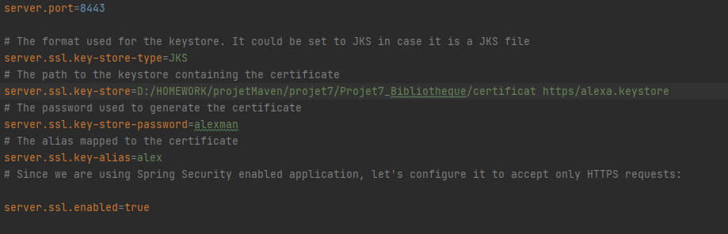

# Projet7_Bibliotheque
Développement d'un nouveau système d’information de la bibliothèque d’une grande ville 

---

## I - Installation du Projet et de la Base données 

---

### 1 - Mise en place du projet

---

Pour commencer, je me suis rendu sur le site : https://start.spring.io/, et j'ai ajouté les dépendances souhaitées :

 - Spring-web qui réunit plusieurs starters, permettant de faire fonctionner comme nous le souhaitons notre microservice.
 - Thymeleaf nous permet d'accéder aux objets dans les pages HTML.
 - Lombok nous permet de nous faciliter la gestion des beans.  

Une fois générer, j'ai ajouté le dossier à mon projet puis mis le dossier en tant que module.

J'ai ajouté dans mon fichier pom.xml, les dépendances à bootstrap en version 4 et à feign pour que les microservices puissent communiquer entre-eux.

### 2 - Création de la base de données sous pgAdmin 4 - V4.19

---

Tout d'abord nous allons créer sous pgAdmin 4 (version 4.19), la base de données :

- Pour commencer, j'ai ajouté la dépendance de postgresql dans mon fichier pom.xml

- Puis j'ai récupérer à partir du logiciel power architect la requête de création de la structure de ma base de données et mis au propre grace à pgModeler :  

### 3 - Modification des chemins

---

- Modifier le chemin du certificat https dans le fichier 'application.properties' du module 'interface abonné' : 

### 4 - Connection employé  

---

- Pour se connecter en tant qu'employé, il faut entrer l'adresse suivante : dupont.regis@yahoo.fr  
et le mot de passe : 123
