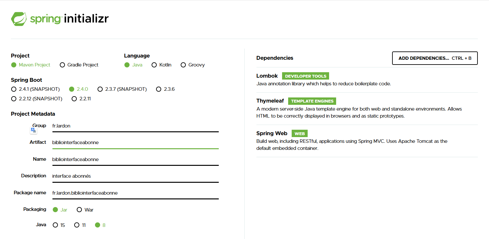

# Projet7_Bibliotheque
Développement d'un nouveau système d’information de la bibliothèque d’une grande ville 

---

## I - Installation et mise en place du Projet et de sa Base de données 

---

### 1 - Mise en place du projet

---

Pour commencer, je me suis rendu sur le site : https://start.spring.io/, et j'ai ajouté les dépendances souhaitées :

 - Spring-web qui réunit plusieurs starters, permettant de faire fonctionner comme nous le souhaitons notre microservice.
 - Thymeleaf nous permet d'accéder aux objets dans les pages HTML.
 - Lombok nous permet de nous faciliter la gestion des beans.  

Une fois générer, j'ai ajouté le dossier à mon projet puis mis le dossier en tant que module.

J'ai reproduit cette opération sur tous les microservices que je souhaitai créer :  

J'ai ajouté dans mes fichiers pom.xml, les dépendances dont j'avais l'utilité en fonction de mes besoins(screen du pom de mon module interface).  

### 2 - Création de la base de données sous pgAdmin 4 - V4.19

---

Tout d'abord nous allons créer sous pgAdmin 4 (version 4.19), la base de données :

- Pour commencer, j'ai ajouté la dépendance de postgresql dans mes fichiers pom.xml utilisant la base de données.  

- Puis j'ai récupéré à partir du logiciel power architect la requête de création de la structure de ma base de données, qu'ensuite j'ai pu créer grace à l'interface pgAdmin 4. 

  
- Je l'ai ensuite mis au propre grace au logiciel pgModeler.  

### 3 - Modification des chemins

---

- Modifier le chemin du certificat https dans le fichier 'application.properties' du module 'interface abonné' : 

### 4 - Connexions aux différents utilisateurs  

---

- Pour se connecter en tant qu'employé, il faut entrer l'adresse suivante : dupont.regis@yahoo.fr  
et le mot de passe : 123  

- Pour se connecter en tant qu'abonné, il faut entrer l'adresse suivante : alexandre.lardon@yahoo.fr  
  et le mot de passe : 123456  

---

## II - Fonctionnement du projet

---  

### 1 - Fonction des différents microservices

---  

 - Chaque microservices gèrent une partie de l'application. Sur mon projet, je les ai répartie en 5 modules :
    * Module biblio-interface-utilisateur
    * Module biblio-gestion-utilisateur
    * Module biblio-authentification-utilisateur
    * Module biblio-catalogue-livres
    * Module biblio-batch
  
 1. __Module biblio-interface-utilisateur :__
      Le premier module gère le côté client et gestion de l'interface des utilisateurs. Il contient tous les fichiers html,css, js, ainsi que les photos illustrant le site. Il récupère les données des autres microservices et les traites par le biais des controllers.  
    
    
 2. __Module biblio-catalogue-livres :__
      Ce module gère toute la partie catalogue, cela regroupe la gestion des ouvrages, des livres et des prêts. Ce module est connecté avec la base de données, et permet de les envoyer au module interface selon ses demandes.  
    

 3. __Module biblio-gestion-utilisateur :__
      Le module de gestion des utilisateurs gère l'ajout de compte utilisateur et la modification de ceux-ci. Ce module est également connecté avec la base de données, il récupère et envoi les données au module interface selon ses demandes.
 

 4. __Module biblio-authentification-utilisateur :__
      Ce module gère uniquement la partie authentification. Il permet la vérification des données saisies par l'utilisateur et renvoi au module interface, les données permettant de connecter l'utilisateur correspondant.  
    

 5. __Module biblio-batch :__
      Le dernier module permet le traitement des batchs. Il permet de récupérer dans la base de données les informations nécessaires à l'envoi de mail aux abonnées en fonction de leurs emprunts et de la restitution de ceux-ci. Les mails sont envoyés à raison de une fois par jour à minuit.
    

### 2 - Mise en place et fonctionnement de la communication entre les modules

---  

 - Les modules communiquent entre eux par le biais de Feign. Feign est un client http qui permet, grace à des requêtes http, la communication entre les microservices. Tout d'abord nous mettons feign en place, pour cela nous ajoutons dans notre fichier pom la dépendance suivante :  

  

 - J'ai ensuite ajouté feign dans mon microservices, suivie du module à scanner, ceci est possible grace à l'annotation suivante : 

  

 - Il ne reste plus qu'à ajouter le client Feign dans les interfaces contenues dans le package proxies, pour cela nous ajoutons l'annotation suivante :  

  

